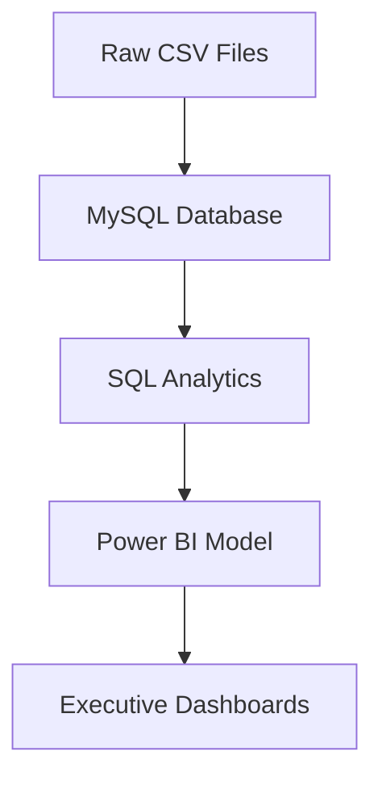

# 🏛 Data Model Documentation

## Brazilian E-Commerce Business Intelligence Project

> Designing an optimized analytical data model for Business Intelligence reporting.

---

# 📖 Table of Contents

- Introduction
- Data Modeling Overview
- Transactional vs Analytical Models
- Database Schema
- Table Relationships
- Data Flow
- Power BI Data Model
- Star Schema Design
- Fact & Dimension Tables
- Relationship Strategy
- DAX Model
- Best Practices
- Conclusion

---

# 📌 Introduction

An effective Business Intelligence solution depends on more than SQL queries and dashboards.

A well-designed **data model** ensures that analytical calculations remain accurate, dashboards perform efficiently, and business metrics are consistent across reports.

This document explains the design decisions behind the data model used throughout the Brazilian E-Commerce Business Intelligence project.

Rather than connecting raw tables directly to Power BI visuals, the project follows a structured analytical model that supports scalable reporting and simplifies business analysis.

---

# 🏗 Data Modeling Overview

The analytical workflow follows several stages before information reaches the dashboards.


Each stage has a clearly defined responsibility.

| Stage | Purpose |
|--------|---------|
| Raw Data | Original transactional data |
| MySQL | Centralized relational storage |
| SQL | Data transformation and analytics |
| Power BI | Semantic model and reporting |
| Dashboards | Business decision support |

---

# 🎯 Data Modeling Objectives

The model was designed around five primary objectives.

## 1. Accuracy

Ensure all KPI calculations produce consistent and reliable results.

---

## 2. Performance

Reduce dashboard refresh times by minimizing unnecessary calculations.

---

## 3. Simplicity

Create a model that business users can easily understand.

---

## 4. Scalability

Allow additional dashboards and KPIs to be added without redesigning the model.

---

## 5. Reusability

Enable DAX measures to be reused across multiple reports.

---

# 🗃 Database Schema

The project integrates several normalized tables that collectively represent the operational processes of an e-commerce marketplace.

| Table | Business Purpose |
|--------|------------------|
| Customers | Customer information and location |
| Orders | Order lifecycle |
| Order Items | Products purchased |
| Products | Product catalog |
| Sellers | Marketplace vendors |
| Payments | Payment transactions |
| Reviews | Customer satisfaction |
| Geolocation | Geographic mapping |
| Product Translation | Category translation |

Each table contributes a specific business dimension while maintaining normalization and referential integrity.

---

# 🔗 Table Relationships

The database follows a normalized relational structure.

```text
Customers
     │
     ▼
Orders
     │
     ▼
Order Items
     ├────────► Products
     │
     └────────► Sellers

Orders
     ├────────► Payments
     │
     └────────► Reviews

Customers
     ▼
Geolocation
```

These relationships allow analytical queries to combine customer, product, seller, payment, and logistics information into a unified reporting model.

---

# 🏛 Transactional vs Analytical Models

The source database is designed for transaction processing (OLTP).

While normalization is ideal for storing operational data, analytical reporting benefits from a simplified structure.

## Transactional Database (OLTP)

Characteristics:

- Highly normalized
- Reduced redundancy
- Optimized for inserts and updates
- Multiple related tables

Suitable for:

- Order processing
- Customer management
- Payments
- Marketplace operations

---

## Analytical Model (OLAP)

Characteristics:

- Optimized for reporting
- Simplified relationships
- Aggregated metrics
- Faster analytical queries

Suitable for:

- Dashboards
- Executive reporting
- KPI monitoring
- Business Intelligence

This project bridges these two worlds by performing SQL transformations before loading data into Power BI.

---

# ⭐ Star Schema Design

The reporting layer follows a simplified analytical model inspired by the Star Schema approach.

Rather than allowing every table to connect to every other table, business entities are organized around central business events.

```text
               Customers

                   │

Products ─── Fact Orders ─── Sellers

                   │

              Payments

                   │

              Calendar
```

This structure simplifies reporting while improving dashboard performance.

---

# 📊 Fact Tables

Fact tables contain measurable business events.

Primary facts represented in this project include:

- Revenue
- Orders
- Order Items
- Delivery Metrics
- Payments

Fact tables typically contain:

- Numeric values
- Transaction identifiers
- Foreign keys
- Dates

Examples:

- Revenue
- Freight Value
- Quantity
- Payment Amount

---

# 📚 Dimension Tables

Dimension tables provide descriptive information used for filtering and grouping.

Examples include:

| Dimension | Description |
|-----------|-------------|
| Customer | Customer attributes |
| Product | Product details |
| Seller | Seller information |
| Geography | State and location |
| Calendar | Date hierarchy |

Dimension tables allow dashboards to answer questions such as:

- Revenue by State
- Orders by Seller
- Revenue by Product Category
- Customer Distribution
- Monthly Sales Trends

---

# 🔄 Data Flow

The reporting pipeline follows a straightforward transformation process.




Rather than loading raw transactional tables directly into reports, SQL performs the majority of analytical processing before Power BI consumes the results.

This approach reduces dashboard complexity while improving maintainability.

---
---

# 🔗 Power BI Relationship Model

Once the transactional data has been prepared in MySQL, it is imported into Power BI where relationships are established between the business entities.

The objective is to create a semantic model that enables intuitive reporting while maintaining accurate KPI calculations.

The relationship model follows several important principles:

- One source of truth for each business entity
- Clear relationship paths
- Minimal ambiguity
- Efficient filter propagation
- Consistent business definitions

Proper relationship design ensures that every visualization reflects accurate business metrics regardless of the filters applied by users.

---

# 🔄 Relationship Strategy

Relationships were designed using one-to-many cardinality wherever possible.

Examples include:

| Parent Table | Child Table | Relationship |
|--------------|-------------|--------------|
| Customers | Orders | One-to-Many |
| Orders | Order Items | One-to-Many |
| Products | Order Items | One-to-Many |
| Sellers | Order Items | One-to-Many |
| Orders | Payments | One-to-Many |
| Orders | Reviews | One-to-Many |

This design minimizes ambiguity and improves report performance.

---

# ➡️ Filter Propagation

One of the most important aspects of a Power BI model is how filters flow between tables.

The model was designed so that filters propagate naturally from dimension tables toward transactional data.

Example:

```text
State
   │
Customer
   │
Orders
   │
Order Items
   │
Revenue
```

When a user selects a specific state, all related KPIs, charts, and tables automatically update to reflect only the relevant transactions.

This behavior enables intuitive exploration without requiring complex user interactions.

---

# 📅 Date Intelligence

Time is a fundamental business dimension.

A dedicated calendar table is recommended for analytical reporting because it enables consistent date-based calculations and simplifies DAX expressions.

Typical attributes include:

- Year
- Quarter
- Month
- Month Number
- Week
- Day
- Fiscal Period (if applicable)

Using a centralized calendar dimension ensures that all reports reference the same definition of time.

---

# 🧮 DAX Measure Design

DAX measures were created to calculate dynamic business metrics that respond automatically to user selections.

Unlike calculated columns, measures are evaluated at query time, making them ideal for interactive dashboards.

Examples of measures used in this project include:

### Revenue Measures

- Total Revenue
- Monthly Revenue
- Revenue Growth
- Revenue Contribution
- Average Order Value

---

### Customer Measures

- Total Customers
- Repeat Customers
- Customer Lifetime Value
- Purchase Frequency
- Average Revenue per Customer

---

### Operational Measures

- Average Delivery Time
- On-Time Delivery Rate
- Orders Delivered
- Cancelled Orders

---

### Executive KPIs

- Total Orders
- Total Sellers
- Total Products
- Revenue Trend
- Customer Growth

These measures form the analytical backbone of the dashboards and ensure that KPI values remain consistent across all report pages.

---

# 📊 Calculated Columns vs Measures

Power BI provides two primary approaches for deriving additional information: calculated columns and measures.

The project favors measures whenever calculations need to respond dynamically to report filters.

| Calculated Columns | Measures |
|--------------------|----------|
| Stored in the model | Calculated at query time |
| Increase model size | More memory efficient |
| Used for categorization | Used for KPIs and aggregations |
| Static after refresh | Dynamic with user interaction |

Understanding when to use each approach improves both model performance and report flexibility.

---

# ⚡ Performance Optimization

Efficient data models are essential for responsive dashboards.

Several optimization techniques were applied during development.

## SQL-First Transformations

Whenever practical, calculations were performed in SQL before loading data into Power BI.

Benefits include:

- Reduced DAX complexity
- Smaller semantic model
- Faster report rendering
- Easier debugging

---

## Reusable Measures

Instead of creating multiple versions of the same calculation, reusable DAX measures were developed and referenced across visuals.

This improves consistency while simplifying maintenance.

---

## Simplified Relationships

Only necessary relationships were included in the data model.

Reducing unnecessary relationship paths decreases ambiguity and improves query performance.

---

## Efficient Visual Design

Dashboard performance benefits from limiting unnecessary visuals and avoiding excessive calculations on a single page.

Visuals were selected based on business value rather than quantity.

---

# 🏛 Data Modeling Best Practices

Several best practices guided the design of the analytical model.

### Business-Oriented Naming

Tables, columns, and measures use descriptive names that are meaningful to business users.

---

### Consistent Metric Definitions

Each KPI is defined once and reused throughout the reporting solution.

This avoids conflicting calculations across dashboard pages.

---

### Minimized Redundancy

Duplicate calculations were avoided whenever possible.

Reusable SQL transformations and DAX measures improve maintainability.

---

### Logical Organization

Measures are grouped according to business domains such as:

- Revenue
- Customers
- Operations
- Geography
- Sellers

This organization simplifies future enhancements.

---

### Scalability

The model was designed to support additional dashboards and KPIs without requiring structural redesign.

Future analytical modules can be incorporated while preserving the existing reporting framework.

---

# 📚 Key Lessons Learned

Developing the data model reinforced several important Business Intelligence principles.

## Data Modeling Is As Important As Visualization

A well-designed dashboard depends on a well-designed model.

Strong visualizations cannot compensate for poor data architecture.

---

## SQL and Power BI Complement Each Other

SQL performs data preparation and analytical calculations.

Power BI focuses on semantic modeling, visualization, and interactive exploration.

Separating responsibilities produces a cleaner and more maintainable solution.

---

## Simplicity Improves Maintainability

Complex models are more difficult to debug and extend.

Keeping relationships straightforward and calculations reusable improves long-term maintainability.

---

## Business Definitions Must Remain Consistent

KPIs should have a single agreed-upon definition across the organization.

A centralized semantic model helps maintain this consistency.

---

# 🏁 Technical Conclusion

The analytical model developed for this project provides a robust foundation for Business Intelligence reporting.

By combining a normalized transactional database, modular SQL transformations, and a structured Power BI semantic model, the project demonstrates an end-to-end analytical architecture suitable for executive reporting.

The design emphasizes accuracy, scalability, maintainability, and performance while supporting interactive dashboard exploration and consistent KPI reporting.

Although developed using the Brazilian E-Commerce dataset, the principles applied throughout this project mirror those used in enterprise Business Intelligence environments.

The data model serves as the bridge between raw operational data and actionable business insights, enabling stakeholders to make informed decisions based on reliable, well-structured information.

---

<div align="center">

## 🏛 Data Models Power Great Dashboards

**Reliable analytics begin with a reliable data model.**

A thoughtfully designed semantic layer transforms complex transactional data into meaningful business intelligence.

</div>
