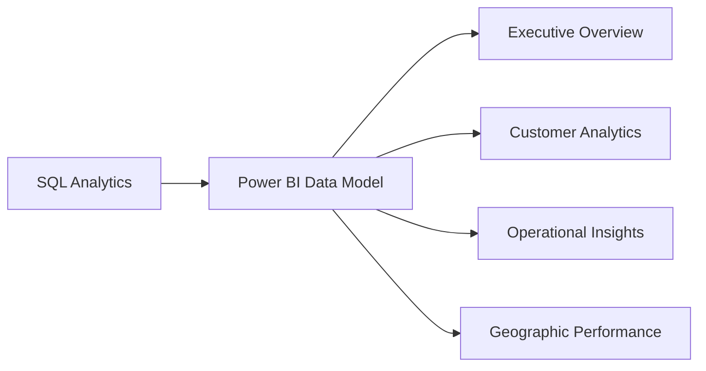
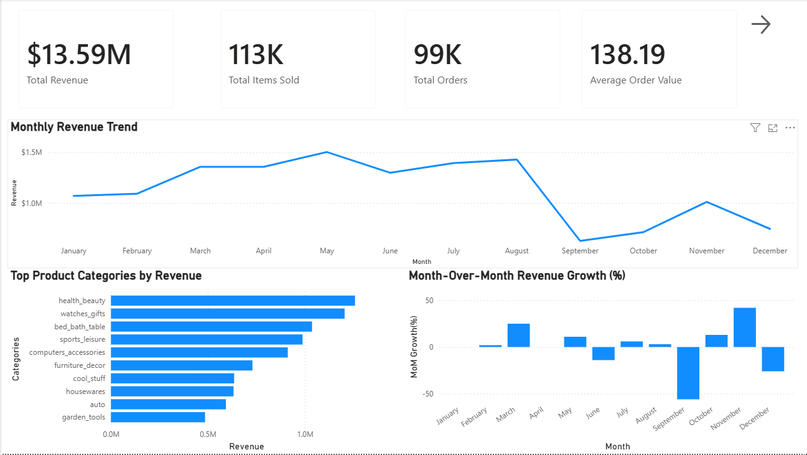
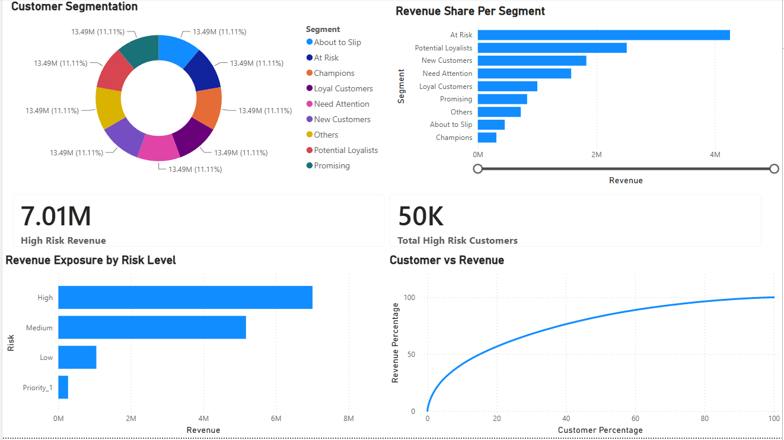
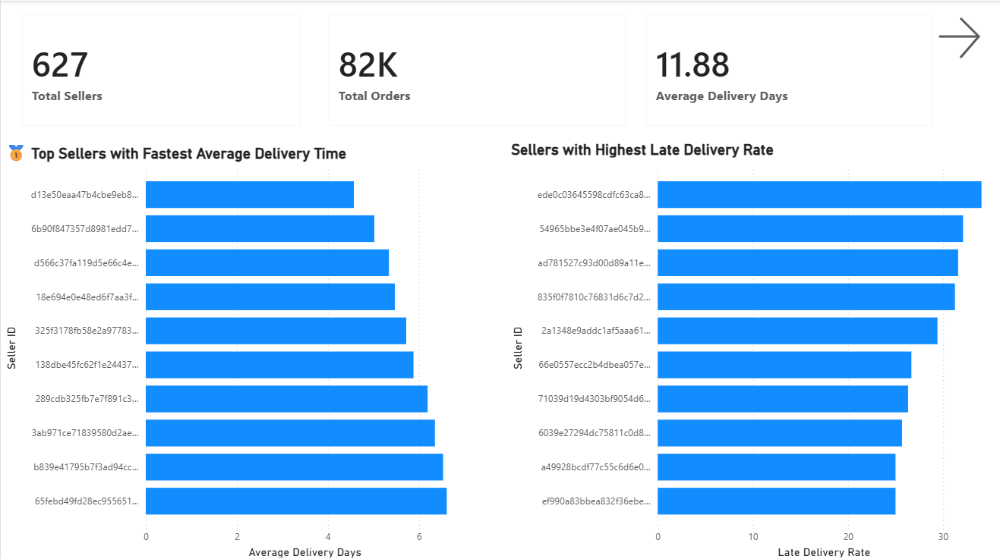
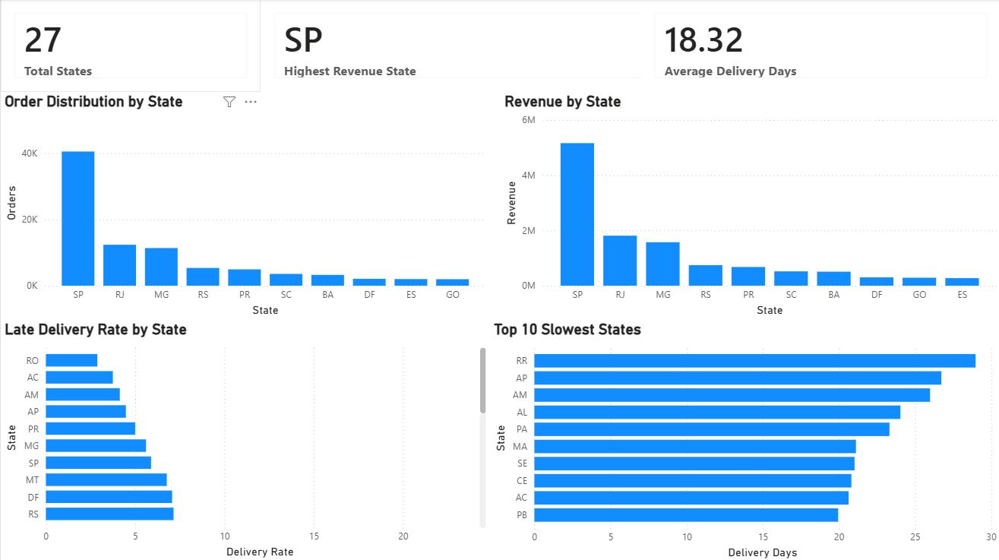

# 📊 Power BI Dashboard Documentation

## Brazilian E-Commerce Business Intelligence Project

> Interactive executive dashboards transforming SQL analytics into business decisions.

---

# 📖 Table of Contents

- Dashboard Overview
- Dashboard Design Philosophy
- Data Model
- Executive Overview Dashboard
- Customer Analytics Dashboard
- Operational Insights Dashboard
- Geographic Performance Dashboard
- Interactive Features
- DAX Measures
- Dashboard Best Practices
- Conclusion

---

# 📌 Dashboard Overview

The Power BI reporting layer represents the final stage of the Business Intelligence workflow.

After collecting, cleaning, and analyzing transactional data using SQL, the analytical outputs are transformed into interactive dashboards designed for executives and business stakeholders.

Rather than presenting raw tables or lengthy reports, the dashboards communicate performance through clear visualizations, KPI cards, trend analysis, and interactive filtering.

Each dashboard addresses a specific business function while remaining connected through a shared data model.

---

# 🎯 Dashboard Objectives

The reporting solution was designed around four primary objectives.

## 1. Executive Reporting

Provide leadership with a centralized overview of company performance.

---

## 2. Customer Intelligence

Understand customer value, purchasing behavior, and retention.

---

## 3. Operational Performance

Monitor logistics efficiency, seller performance, and delivery reliability.

---

## 4. Geographic Analysis

Evaluate regional performance across Brazilian states.

---

# 🏗 Dashboard Architecture

The dashboards are connected through a centralized Power BI data model, ensuring that slicers, filters, and relationships remain consistent across all reporting pages.

---

# 🎨 Dashboard Design Philosophy

The dashboards were designed according to several Business Intelligence best practices.

## Simplicity

Only the most important KPIs are displayed.

Visual clutter was intentionally minimized.

---

## Consistency

Colors, typography, spacing, and KPI placement remain consistent throughout every dashboard page.

This allows users to navigate naturally without repeatedly learning new layouts.

---

## Business Storytelling

Rather than displaying isolated charts, each page answers a specific business question.

The visual hierarchy guides users from high-level KPIs toward more detailed analyses.

---

## Interactive Exploration

Users can investigate trends through:

- Slicers
- Filters
- Cross-highlighting
- Drill-down functionality

This encourages self-service analytics while reducing dependence on static reports.

---

# 📊 Dashboard 1 — Executive Overview

 

<b>Figure 1.</b> Executive Overview Dashboard

---

## Dashboard Purpose

The Executive Overview dashboard serves as the central reporting page for senior leadership.

It consolidates the most important business metrics into a single view, allowing decision-makers to evaluate company performance without navigating multiple reports.

The dashboard provides an immediate snapshot of financial performance, customer activity, and operational efficiency.

---

## Primary Audience

- Executive Leadership
- Business Managers
- Finance Teams
- Department Heads

---

## Primary KPIs

- Total Revenue
- Total Orders
- Total Customers
- Average Order Value
- Average Delivery Time
- Revenue Growth
- Order Volume
- Customer Growth

---

## Visual Components

### KPI Cards

Large KPI cards communicate overall business performance immediately upon opening the dashboard.

---

### Monthly Revenue Trend

A line chart illustrates revenue progression across time, allowing executives to identify growth trends and seasonality.

---

### Revenue by Category

A ranked visualization highlights the product categories generating the highest revenue.

---

### Geographic Distribution

Regional performance is displayed using map visualizations and state-level comparisons.

---

### Interactive Filters

Users can filter results dynamically based on business dimensions.

---

## Business Questions Answered

The dashboard enables executives to answer questions such as:

- Is revenue increasing?
- Are customer numbers growing?
- Which product categories perform best?
- Which states contribute most revenue?
- Is operational performance improving?

---

## Business Value

Rather than reviewing multiple operational reports, executives receive a centralized performance overview capable of supporting faster strategic decision-making.

The dashboard reduces reporting complexity while improving organizational transparency.

---

# 👥 Dashboard 2 — Customer Analytics

 

<b>Figure 2.</b> Customer Analytics Dashboard

---

## Dashboard Purpose

Customer Analytics focuses on understanding customer behavior rather than simply measuring customer counts.

The dashboard combines SQL analyses including Customer Lifetime Value, RFM Segmentation, and Cohort Analysis into an integrated customer intelligence platform.

Rather than treating every customer equally, the dashboard highlights behavioral differences that support personalized engagement strategies.

---

## Primary Audience

- Marketing Teams
- CRM Teams
- Customer Success
- Executive Leadership

---

## Primary KPIs

- Customer Lifetime Value
- Purchase Frequency
- Repeat Purchase Rate
- Customer Segments
- Customer Revenue
- Cohort Retention

---

## Visual Components

### Customer Distribution

Displays how purchasing activity is distributed across the customer base.

---

### RFM Segmentation

Groups customers according to Recency, Frequency, and Monetary value.

---

### Customer Lifetime Value

Highlights long-term customer profitability.

---

### Cohort Analysis

Visualizes customer retention across acquisition months.

---

### Customer Rankings

Identifies high-value customers.

---

## Business Questions Answered

- Who are the most valuable customers?
- Which customers are most loyal?
- Which customers are likely to churn?
- Which acquisition cohorts perform best?
- Which customers should receive personalized marketing?

---

## Business Value

Customer Analytics enables organizations to move beyond generic marketing by supporting segmentation, retention strategies, and customer lifetime value optimization.

The dashboard provides actionable insights that improve customer engagement while maximizing long-term profitability.

---
---

# 🚚 Dashboard 3 — Operational Insights

 

<b>Figure 3.</b> Operational Insights Dashboard

---

## Dashboard Purpose

Operational performance has a direct impact on customer satisfaction, operational costs, and overall business profitability.

The Operational Insights dashboard monitors the efficiency of the order fulfillment process by evaluating delivery performance, seller reliability, shipping timelines, and logistics KPIs.

Rather than focusing exclusively on revenue, this dashboard highlights the operational drivers behind customer experience.

---

## Primary Audience

- Operations Managers
- Supply Chain Teams
- Marketplace Managers
- Executive Leadership

---

## Primary KPIs

- Average Delivery Time
- On-Time Delivery Rate
- Late Deliveries
- Average Freight Cost
- Orders Delivered
- Seller Performance

---

## Visual Components

### Delivery Performance

Displays the distribution of delivery times across completed orders.

---

### Seller Rankings

Ranks sellers based on revenue generation, fulfillment efficiency, and operational performance.

---

### Delivery Status

Visualizes completed, delayed, and pending deliveries.

---

### Delivery Trends

Shows operational performance over time to identify improvements or deterioration.

---

### Operational KPI Cards

Provides executives with immediate visibility into logistics performance.

---

## Business Questions Answered

- How efficiently are orders delivered?
- Which sellers consistently outperform others?
- Which sellers require operational improvements?
- Are delivery times improving?
- Where are logistics bottlenecks occurring?

---

## Business Value

Efficient logistics improve customer satisfaction while reducing operational costs.

This dashboard enables operations teams to identify bottlenecks, monitor seller performance, and improve fulfillment efficiency using data-driven insights.

---

# 🌎 Dashboard 4 — Geographic Performance

 

<b>Figure 4.</b> Geographic Performance Dashboard

---

## Dashboard Purpose

Business performance varies considerably across different geographic markets.

This dashboard enables decision-makers to compare revenue, customer distribution, delivery performance, and operational efficiency across Brazilian states.

Instead of viewing the business as a single entity, leadership can evaluate regional performance individually.

---

## Primary Audience

- Executive Leadership
- Regional Managers
- Logistics Teams
- Sales Teams

---

## Primary KPIs

- Revenue by State
- Orders by State
- Customer Distribution
- Average Delivery Time
- Freight Cost
- Revenue Contribution

---

## Visual Components

### Interactive Map

Visualizes business performance geographically.

---

### Revenue by State

Ranks states according to financial performance.

---

### Customer Distribution

Shows where marketplace demand is concentrated.

---

### Regional Delivery Performance

Highlights delivery efficiency across different states.

---

### Comparative Visualizations

Enable direct comparison between geographic regions.

---

## Business Questions Answered

- Which regions generate the highest revenue?
- Where are customers located?
- Which states experience operational challenges?
- Which markets represent future growth opportunities?
- How does delivery performance differ geographically?

---

## Business Value

Regional insights enable better logistics planning, inventory allocation, and strategic market expansion.

Interactive geographic reporting also allows executives to identify regional opportunities within seconds rather than manually comparing spreadsheets.

---

# ⚡ Interactive Dashboard Features

A key objective of this reporting solution was to create dashboards that encourage exploration rather than static reporting.

The following interactive capabilities were implemented throughout the Power BI solution.

---

## Dynamic Slicers

Users can filter dashboard results by:

- State
- Product Category
- Time Period
- Seller
- Customer Segment

Interactive filtering allows business users to investigate specific business scenarios without modifying the underlying reports.

---

## Cross-Filtering

Selecting any visual automatically updates related charts across the dashboard.

This functionality enables users to explore relationships between multiple business dimensions.

---

## Drill-Down Analysis

Hierarchical visualizations allow users to move from high-level summaries to more detailed information.

Examples include:

- Year → Month
- State → City
- Category → Product

This supports both executive reporting and operational investigation.

---

## Responsive KPI Cards

KPI cards dynamically update based on user selections.

This provides immediate feedback when filters or slicers are applied.

---

## Interactive Maps

Geographic visualizations enable users to identify regional performance differences without requiring separate reports.

---

# 🧮 DAX Measures

Several DAX measures were created to support executive reporting and dashboard interactivity.

Examples include:

- Total Revenue
- Average Order Value
- Total Customers
- Total Orders
- Revenue Growth
- Average Delivery Time
- On-Time Delivery Rate
- Customer Lifetime Value
- Revenue Contribution

These measures ensure that KPI calculations remain dynamic and automatically update as users interact with dashboard filters.

---

# 📐 Dashboard Design Best Practices

Several Business Intelligence design principles guided dashboard development.

## Clear Visual Hierarchy

The most important KPIs are positioned at the top of each dashboard.

Supporting visualizations appear beneath the summary metrics, enabling users to move naturally from overview to detail.

---

## Consistent Layout

Each dashboard follows a similar layout to minimize the learning curve for users.

Consistency improves usability while reducing cognitive load.

---

## Minimal Visual Clutter

Only visualizations that directly support business decision-making were included.

Decorative charts and unnecessary graphics were intentionally avoided.

---

## Business-Oriented Design

Every visualization answers a specific business question.

Rather than maximizing the number of charts, the dashboards prioritize clarity, context, and actionable insights.

---

## Performance Optimization

Dashboard performance was considered throughout development.

Optimization techniques include:

- Efficient SQL preprocessing
- Reusable DAX measures
- Optimized data model relationships
- Reduced visual complexity
- Limited unnecessary calculations

These practices improve report responsiveness and scalability.

---

# 📚 Key Lessons Learned

Developing this reporting solution provided valuable experience across several areas of Business Intelligence.

Key lessons include:

- Business questions should drive dashboard design.
- Effective SQL simplifies downstream reporting.
- KPI selection is more important than the number of visualizations.
- Clear dashboards improve executive decision-making.
- Customer analytics provides significant strategic value.
- Consistent design enhances user experience.
- Business storytelling is as important as technical implementation.

---

# 🏁 Conclusion

The Power BI reporting layer represents the final stage of the Business Intelligence workflow.

By integrating SQL analytics, interactive dashboards, and executive-focused KPIs, the project transforms transactional data into actionable business intelligence.

Rather than functioning as static reports, these dashboards enable stakeholders to monitor business performance, investigate trends, and support strategic decision-making through intuitive visual exploration.

The combination of SQL, Power BI, and business analysis demonstrated throughout this project reflects the practical workflow commonly used by Business Intelligence Analysts and Data Analysts in industry.

---

## 📊 Turning Analytics into Action

**The true value of Business Intelligence lies not in collecting data, but in enabling better decisions.**

