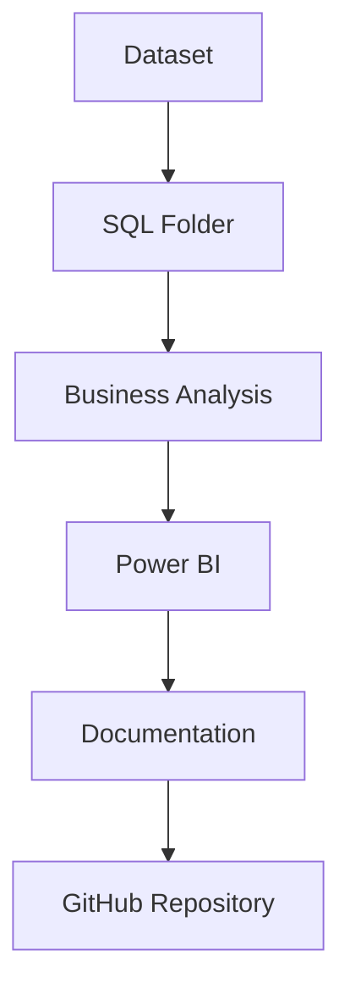

# 🏗 Project Architecture

## Brazilian E-Commerce Business Intelligence Project

> End-to-End Analytics Architecture using MySQL, SQL, and Microsoft Power BI

---

# 📖 Table of Contents

- Architecture Overview
- End-to-End Workflow
- Data Pipeline
- Repository Architecture
- Technology Stack
- Data Lifecycle
- SQL Layer
- Power BI Layer
- Reporting Layer
- Scalability
- Future Architecture
- Conclusion

---

# 📌 Architecture Overview

The Brazilian E-Commerce Business Intelligence project follows a layered analytical architecture designed to transform raw transactional data into executive-ready business insights.

Rather than connecting dashboards directly to raw datasets, the solution separates each stage of the analytical workflow into independent layers.

This architecture improves maintainability, simplifies debugging, enables future scalability, and mirrors the workflow commonly used in Business Intelligence teams.

---

# 🏛 End-to-End Architecture


---

# 📥 Data Collection Layer

The project begins with publicly available transactional datasets from the Brazilian E-Commerce (Olist) marketplace.

The raw data consists of multiple CSV files representing different business entities.

These include:

- Customers
- Orders
- Order Items
- Products
- Sellers
- Payments
- Reviews
- Geolocation
- Product Category Translation

Each dataset represents one component of the operational business process.

---

# 🗄 Database Layer

All datasets are imported into MySQL where they maintain their normalized relational structure.

The database serves as the centralized storage layer for the analytical workflow.

Primary responsibilities include:

- Data storage
- Relationship management
- Query execution
- Data validation
- Source of truth

---

# 🧹 Data Preparation Layer

Before analysis begins, SQL is used to prepare the data.

Preparation tasks include:

- Data cleaning
- Null handling
- Category translation
- Relationship validation
- Business rule implementation

Clean data ensures accurate KPIs and reliable dashboard reporting.

---

# 💻 SQL Analytics Layer

SQL functions as the analytical engine of the project.

Rather than querying data directly inside Power BI, business metrics are calculated within MySQL.

Major analytical modules include:

- Order Analysis
- Revenue Analysis
- Customer Analysis
- Product Analysis
- Seller Analysis
- Time Series Analysis
- Customer Lifetime Value
- RFM Segmentation
- Cohort Analysis
- Pareto Analysis
- Delivery Performance

This modular design improves maintainability and keeps business logic centralized.

---

# 📊 Semantic Modeling Layer

After SQL processing, the analytical outputs are imported into Power BI.

Power BI creates a semantic model responsible for:

- Relationships
- Measures
- Calculated columns
- Time intelligence
- Interactive filtering

Separating SQL calculations from visualization improves dashboard performance and simplifies maintenance.

---

# 📈 Reporting Layer

The reporting layer consists of four interactive dashboards.

1. Executive Overview

Executive KPI reporting.

---

2. Customer Analytics

Customer Lifetime Value, RFM, Cohort Analysis, customer segmentation.

---

3. Operational Insights

Seller performance, delivery performance, logistics.

---

4. Geographic Performance

Revenue by state, customer distribution, regional logistics.

Together, these dashboards provide a comprehensive view of marketplace performance.

---

# 🔄 Repository Workflow



---

# 📁 Repository Structure

```text
Brazilian-Ecommerce-Business-Intelligence
│
├── README.md
├── LICENSE
├── CONTRIBUTING.md
├── .gitignore
│
├── assets/
│
├── docs/
│
├── powerbi/
│
├── sql/
│
└── dataset/
```

---

# ⚙ Technology Stack

| Layer | Technology |
|--------|------------|
| Data Storage | MySQL |
| Analytics | SQL |
| Visualization | Microsoft Power BI |
| Calculations | DAX |
| Documentation | Markdown |
| Version Control | Git |
| Repository | GitHub |

---

# 🚀 Scalability

The modular architecture supports future enhancements such as:

- Automated ETL pipelines
- Azure SQL Database
- Microsoft Fabric
- Snowflake
- Python automation
- Real-time dashboards
- Predictive analytics

Because each layer is independent, future changes can be implemented with minimal impact on the existing solution.

---

# 📚 Architecture Principles

The solution was designed around several key principles.

- Separation of responsibilities
- Modular SQL development
- Centralized business logic
- Reusable calculations
- Interactive reporting
- Maintainable documentation
- Scalable design

These principles reflect common Business Intelligence architecture patterns used in enterprise analytics environments.

---

# 🏁 Conclusion

This project demonstrates an end-to-end Business Intelligence workflow that transforms raw transactional data into executive dashboards and actionable business insights.

By separating data storage, SQL analytics, semantic modeling, visualization, and documentation into dedicated layers, the architecture remains organized, maintainable, and scalable.

The approach mirrors real-world Business Intelligence solutions where SQL, Power BI, and business reporting work together to support informed decision-making.

---

<div align="center">

### 🏗 Good Architecture Makes Great Analytics

A well-designed architecture enables reliable insights, scalable reporting, and confident business decisions.

</div>
