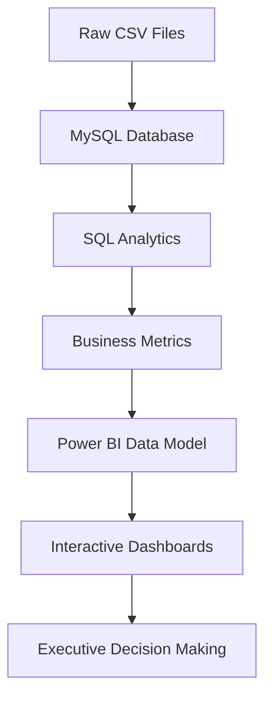
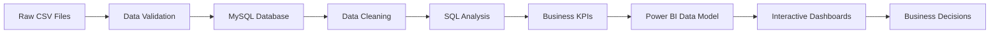

<div align="center">

# 🇧🇷 Brazilian E-Commerce Business Intelligence

### End-to-End SQL & Power BI Analytics Solution

<p align="center">

Transforming **100,000+ e-commerce transactions** into **executive business insights** through advanced **SQL**, **Power BI**, and **Business Intelligence**.

</p>

<p align="center">


</p>

---


### 📊 From Raw Data → Business Decisions

*A complete Business Intelligence solution built using MySQL, SQL, Power BI, and DAX to analyze customer behavior, sales performance, logistics, revenue trends, and operational efficiency.*

</div>

---

# 📖 Table of Contents

- [Project Overview](#-project-overview)
- [Executive Summary](#-executive-summary)
- [Business Problem](#-business-problem)
- [Business Objectives](#-business-objectives)
- [Project Snapshot](#-project-snapshot)
- [Technology Stack](#-technology-stack)
- [Project Architecture](#-project-architecture)
- [Database Overview](#-database-overview)
- [Repository Structure](#-repository-structure)
- [SQL Analysis Modules](#-sql-analysis-modules)
- [Power BI Dashboards](#-power-bi-dashboards)
- [Business Insights](#-business-insights)
- [Business Recommendations](#-business-recommendations)
- [Skills Demonstrated](#-skills-demonstrated)
- [Future Improvements](#-future-improvements)
- [About Me](#-about-me)
- [License](#-license)

---

# ⭐ Recruiter Quick View

> **If you only have 30 seconds, here's what this project demonstrates.**

✅ Advanced SQL

✅ MySQL

✅ Power BI

✅ DAX

✅ Data Cleaning

✅ Business Intelligence

✅ Customer Analytics

✅ Revenue Analytics

✅ Executive Dashboard Design

✅ Data Storytelling

✅ Customer Segmentation (RFM)

✅ Cohort Analysis

✅ Pareto Analysis

✅ Window Functions

✅ KPI Development

---

# 📌 Project Overview

Business Intelligence is far more than writing SQL queries or creating visually appealing dashboards.

Its primary objective is to transform raw operational data into meaningful information that supports better business decisions.

Every day, modern e-commerce companies generate thousands of transactions across customers, sellers, payments, logistics, deliveries, and products. While this data contains valuable insights, extracting meaningful information requires a structured analytical process.

This repository presents a complete Business Intelligence solution developed using the **Brazilian E-Commerce Public Dataset by Olist**.

Rather than treating SQL, Power BI, and reporting as separate activities, this project demonstrates an end-to-end analytical workflow beginning with relational data stored inside MySQL and ending with interactive executive dashboards capable of supporting strategic business decisions.

The solution integrates advanced SQL analytics with Microsoft Power BI to answer real-world business questions related to:

- Revenue performance
- Customer behavior
- Product performance
- Seller performance
- Geographic distribution
- Operational efficiency
- Customer retention
- Logistics performance

Instead of producing isolated reports, the project delivers a centralized reporting platform designed for executives, finance teams, marketing departments, and operations managers.

Every dashboard, KPI, and SQL query included in this repository was developed with a business objective rather than a purely technical objective.

---

# 📈 Executive Summary

The Brazilian E-Commerce marketplace generates hundreds of thousands of transactional records across customers, products, sellers, payments, and deliveries.

Raw transactional data alone provides limited value unless it can be transformed into actionable business intelligence.

The objective of this project was to design and develop a centralized Business Intelligence solution capable of converting operational data into interactive dashboards and executive insights.

Using SQL as the analytical engine and Power BI as the visualization platform, this project explores multiple business domains including customer analytics, financial performance, logistics, and regional operations.

The analytical solution includes:

- Advanced SQL analysis
- Executive KPI reporting
- Customer Lifetime Value (CLV)
- Customer Segmentation using RFM
- Cohort Analysis
- Pareto Analysis (80/20 Rule)
- Revenue Analysis
- Seller Performance Analysis
- Product Category Analysis
- Geographic Performance Analysis
- Delivery Performance Analysis
- Time-Series Analysis

The resulting dashboards provide decision-makers with a single source of truth for monitoring company performance across multiple business functions.

---

# 💼 Business Problem

Organizations continuously collect operational data through sales transactions, customer interactions, payment systems, logistics operations, and supplier networks.

However, many organizations struggle to answer critical business questions such as:

- Which customers generate the highest long-term value?
- Which product categories contribute the greatest revenue?
- Which sellers consistently outperform competitors?
- Which regions experience operational inefficiencies?
- Which customers are likely to churn?
- Which marketing efforts improve retention?
- How concentrated is total company revenue?
- Which operational bottlenecks reduce customer satisfaction?

Without a centralized Business Intelligence platform, answering these questions often requires manual analysis across multiple disconnected reports.

This project addresses those challenges by integrating transactional data into a unified analytical solution capable of providing real-time business insights through SQL-driven analytics and interactive Power BI dashboards.

---

# 🎯 Business Objectives

The project was designed around five primary analytical domains.

## 💰 Revenue Analytics

Understand financial performance through:

- Total Revenue
- Monthly Revenue
- Revenue Growth
- Average Order Value
- Revenue by Category
- Revenue by State
- Revenue Contribution

---

## 👥 Customer Analytics

Analyze customer purchasing behavior using:

- Customer Lifetime Value
- Purchase Frequency
- Customer Segmentation
- Cohort Analysis
- Customer Retention
- RFM Analysis

---

## 🚚 Operational Analytics

Evaluate operational efficiency through:

- Delivery Performance
- Average Delivery Time
- Late Deliveries
- Seller Performance
- Fulfillment Efficiency

---

## 🌎 Geographic Analytics

Compare regional business performance through:

- Revenue by State
- Customer Distribution
- Delivery Performance
- Regional Growth
- Order Volume

---

## 📊 Executive Reporting

Provide executives with a centralized dashboard containing:

- Company KPIs
- Revenue Trends
- Customer Growth
- Delivery Performance
- Sales Performance
- Business Health Indicators

---

# 📊 Project Snapshot

| Metric | Value |
|---------|------:|
| Orders Analyzed | 99,441+ |
| Customers | 96,096 |
| Sellers | 3,095 |
| Products | 32,951 |
| Product Categories | 71 |
| Brazilian States | 27 |
| SQL Scripts | 12 |
| Interactive Dashboards | 4 |
| KPIs Tracked | 40+ |
| Business Insights Generated | 50+ |

---

# 🛠 Technology Stack

| Category | Technologies Used |
|-----------|-------------------|
| Database | MySQL |
| Query Language | SQL |
| Visualization | Microsoft Power BI |
| Calculated Measures | DAX |
| Data Transformation | Power Query |
| Version Control | Git |
| Repository Hosting | GitHub |
| Documentation | Markdown |
| Dataset | Brazilian E-Commerce Public Dataset (Olist) |

---

# 🏗 Project Architecture



The architecture follows a layered Business Intelligence approach, separating data ingestion, analytical processing, visualization, and business reporting into independent stages. This modular design improves maintainability, scalability, and enables future enhancements without affecting the overall solution.

---

# 🗄️ Database Overview

The foundation of this Business Intelligence solution is the **Brazilian E-Commerce Public Dataset by Olist**, one of the most comprehensive publicly available e-commerce datasets for analytical projects.

The dataset captures real-world marketplace transactions between **September 2016 and October 2018**, providing detailed information about customers, orders, sellers, products, payments, reviews, and logistics.

Unlike simplified datasets commonly used in tutorials, the Olist dataset represents a normalized relational database containing multiple interconnected entities. This structure closely resembles transactional databases found in modern e-commerce organizations, making it ideal for demonstrating SQL analytics, data modeling, and Business Intelligence reporting.

The project integrates these datasets into a unified analytical environment using MySQL before transforming them into interactive dashboards using Microsoft Power BI.

---

# 📦 Dataset Overview

| Dataset | Description |
|----------|-------------|
| Customers | Customer identifiers and locations |
| Orders | Order lifecycle and timestamps |
| Order Items | Individual products within each order |
| Payments | Payment methods and payment values |
| Products | Product catalog and category information |
| Sellers | Seller information and locations |
| Reviews | Customer review scores |
| Geolocation | Geographic coordinates by ZIP code |
| Product Translation | Portuguese-to-English category mapping |

These datasets are connected through relational keys, enabling multidimensional analysis across customers, products, sellers, payments, logistics, and geography.

---

# 🧩 Database Relationships

The analytical model relies on relationships between transactional and dimensional tables.

```text
Customers
     │
     │ customer_id
     ▼
Orders
     │
     │ order_id
     ▼
Order Items
     │
     ├────────► Products
     │
     └────────► Sellers

Orders
     │
     ├────────► Payments
     │
     └────────► Reviews

Customers
     │
     ▼
Geolocation
```

This normalized structure enables efficient joins while reducing data redundancy.

The relationships support business questions spanning multiple domains, including customer analytics, financial reporting, operational performance, and geographic analysis.

---

# 🏛 Business Intelligence Workflow

The project follows a structured Business Intelligence lifecycle that transforms raw transactional data into actionable business insights.



Each stage of the workflow has a specific responsibility:

### 📥 Data Collection

Raw CSV files are imported into MySQL, preserving the relational structure of the original dataset.

---

### 🧹 Data Cleaning

Data quality checks ensure analytical accuracy by:

- Removing invalid records
- Handling missing values
- Validating relationships
- Standardizing category names
- Verifying timestamps

---

### 📊 SQL Analytics

SQL serves as the analytical engine of the project.

The queries calculate:

- Revenue metrics
- Customer behavior
- Product performance
- Seller rankings
- Delivery performance
- Customer Lifetime Value
- Customer Segmentation
- Cohort Retention
- Revenue Concentration

---

### 📈 Data Modeling

Power BI transforms SQL outputs into an optimized reporting model through:

- Relationships
- Calculated columns
- DAX measures
- Hierarchies
- Interactive filtering

---

### 📉 Business Reporting

The final dashboards present analytical results in a format suitable for executives and business stakeholders.

---

# ⚙️ SQL Concepts Demonstrated

This repository showcases a broad range of SQL concepts commonly used in Data Analyst, Business Intelligence Analyst, and Analytics Engineer roles.

---

## Data Retrieval

- SELECT
- DISTINCT
- WHERE
- ORDER BY
- LIMIT

---

## Joins

- INNER JOIN
- LEFT JOIN
- Multi-table joins
- Relationship-based querying

---

## Aggregations

- SUM()
- AVG()
- COUNT()
- COUNT(DISTINCT)
- MIN()
- MAX()

---

## Conditional Logic

- CASE
- IFNULL()
- COALESCE()

---

## Date Functions

- MONTH()
- MONTHNAME()
- YEAR()
- TIMESTAMPDIFF()
- DATEDIFF()
- DATE_SUB()

---

## Window Functions

- ROW_NUMBER()
- RANK()
- DENSE_RANK()
- NTILE()
- LAG()
- SUM() OVER()

---

## Common Table Expressions

Multiple analytical workflows are implemented using CTEs to improve readability and modularity.

These include:

- Revenue calculations
- RFM analysis
- Cohort analysis
- Pareto analysis
- Customer Lifetime Value

---

## Business Analytics Techniques

The project demonstrates several advanced analytical methodologies frequently used in Business Intelligence.

### Customer Lifetime Value (CLV)

Estimates the long-term monetary value generated by each customer.

---

### RFM Segmentation

Segments customers using:

- Recency
- Frequency
- Monetary Value

to identify high-value customers and churn risk.

---

### Cohort Analysis

Measures customer retention by grouping users according to their first purchase month.

---

### Pareto Analysis

Evaluates the classic 80/20 principle to determine how much revenue is generated by the highest-value customers.

---

### Time Series Analysis

Analyzes monthly revenue trends, seasonality, and growth patterns.

---

# 📂 Repository Structure

```text
Brazilian-Ecommerce-Business-Intelligence
│
├── README.md
├── LICENSE
├── .gitignore
├── CONTRIBUTING.md
│
├── assets
│   ├── banner.png
│   ├── architecture.png
│   ├── er-diagram.png
│   ├── executive-overview.png
│   ├── customer-analytics.png
│   ├── operational-insights.png
│   ├── state-analysis.png
│   └── social-preview.png
│
├── sql
│   ├── 01_database_setup.sql
│   ├── 02_order_analysis.sql
│   ├── 03_customer_behavior_analysis.sql
│   ├── 04_revenue_analysis.sql
│   ├── 05_customer_lifetime_value.sql
│   ├── 06_product_and_seller_analysis.sql
│   ├── 07_product_category_analysis.sql
│   ├── 08_time_series_analysis.sql
│   ├── 09_RFM_analysis.sql
│   ├── 10_cohort_analysis.sql
│   ├── 11_pareto_analysis.sql
│   └── 12_delivery_analysis.sql
│
├── powerbi
│   └── Brazilian_Ecommerce_BI.pbix
│
├── docs
│   ├── BUSINESS_INSIGHTS.md
│   ├── SQL_ANALYSIS.md
│   ├── POWERBI_DASHBOARDS.md
│   ├── DATA_MODEL.md
│   └── PROJECT_ARCHITECTURE.md
│
└── dataset
```

---

# 📜 SQL Analysis Modules

The analytical core of this project consists of **12 modular SQL scripts**, each focusing on a different aspect of the business.

Rather than writing one large SQL file, the project follows a modular approach where every script addresses a specific business domain. This structure improves readability, maintainability, debugging, and future scalability while closely reflecting how analytics projects are organized in professional environments.

Together, these modules transform raw transactional data into meaningful business intelligence that powers the Power BI dashboards included in this repository.

---

# 📂 Module 01 — Database Setup

📄 **File:** `01_database_setup.sql`

## Objective

The first module establishes the analytical environment by creating the database schema, importing the raw datasets, and validating relationships between tables.

A reliable database structure is the foundation of every Business Intelligence solution. Before performing any analysis, it is essential to ensure that all tables are loaded correctly, relationships are preserved, and the data is ready for downstream analytics.

---

### SQL Concepts Used

- CREATE DATABASE
- CREATE TABLE
- LOAD DATA
- Data Validation
- Primary & Foreign Key Relationships

---

### Business Questions Addressed

- Has the dataset been imported correctly?
- Are all tables available for analysis?
- Do relational keys connect correctly?
- Is the database ready for analytical reporting?

---

### Business Value

This module creates a clean and reproducible analytical environment, ensuring that every subsequent SQL analysis is built upon reliable and validated data.

---

# 📦 Module 02 — Order Analysis

📄 **File:** `02_order_analysis.sql`

## Objective

Orders represent the core transaction of an e-commerce business. This module analyzes order activity, fulfillment performance, and operational efficiency.

The analysis measures overall order volume while identifying delivery success, cancellations, and fulfillment trends.

---

### Key KPIs

- Total Orders
- Delivered Orders
- Cancelled Orders
- Order Status Distribution
- Average Delivery Time
- On-Time Delivery Rate

---

### Business Questions Addressed

- How many orders were successfully completed?
- What percentage of orders were cancelled?
- How long does delivery typically take?
- Is fulfillment performance improving?

---

### SQL Techniques

- GROUP BY
- Aggregate Functions
- Date Calculations
- CASE Statements
- Multi-table Joins

---

### Business Value

Order fulfillment directly impacts customer satisfaction and operational efficiency. This analysis enables leadership to monitor service quality while identifying opportunities to improve logistics performance.

---

# 👥 Module 03 — Customer Behavior Analysis

📄 **File:** `03_customer_behavior_analysis.sql`

## Objective

Understanding customer purchasing behavior is essential for sustainable business growth.

This module examines customer purchasing patterns, repeat purchases, order frequency, and overall engagement with the marketplace.

---

### Key KPIs

- Total Customers
- Repeat Customers
- Purchase Frequency
- Orders per Customer
- Customer Ranking

---

### Business Questions Addressed

- How often do customers return?
- What percentage of customers make repeat purchases?
- Who are the most active customers?
- How concentrated are customer purchases?

---

### SQL Techniques

- COUNT(DISTINCT)
- GROUP BY
- ORDER BY
- Ranking
- Aggregation

---

### Business Value

The analysis helps marketing teams identify loyal customers while providing insight into customer retention and purchasing behavior.

---

# 💰 Module 04 — Revenue Analysis

📄 **File:** `04_revenue_analysis.sql`

## Objective

Revenue analysis measures the company's financial performance across multiple dimensions including time, orders, and customer purchasing behavior.

The module transforms raw transactional data into executive financial KPIs that can be monitored through Power BI dashboards.

---

### Key KPIs

- Total Revenue
- Monthly Revenue
- Average Order Value
- Revenue Growth
- Revenue Trend

---

### Business Questions Addressed

- Is company revenue increasing?
- Which months generate the highest sales?
- How much does the average customer spend?
- Are there seasonal sales trends?

---

### SQL Techniques

- SUM()
- AVG()
- GROUP BY
- Window Functions
- Monthly Aggregations

---

### Business Value

Revenue analytics supports financial planning, budgeting, and executive reporting by providing continuous visibility into company performance.

---

# 💎 Module 05 — Customer Lifetime Value (CLV)

📄 **File:** `05_customer_lifetime_value.sql`

## Objective

Customer Lifetime Value estimates the total revenue generated by each customer throughout their relationship with the business.

Rather than evaluating customers based on individual purchases, CLV measures long-term profitability.

---

### Key KPIs

- Customer Revenue
- Purchase Frequency
- Average Order Value
- Estimated Customer Lifetime Value

---

### Business Questions Addressed

- Which customers generate the most revenue?
- How valuable is each customer over time?
- Which customers should receive priority retention efforts?

---

### SQL Techniques

- CTEs
- Aggregate Functions
- Customer-Level Analysis
- Revenue Calculations

---

### Business Value

CLV enables organizations to allocate marketing budgets more effectively while prioritizing customer retention strategies.

---

# 🏪 Module 06 — Product & Seller Analysis

📄 **File:** `06_product_and_seller_analysis.sql`

## Objective

Marketplace success depends on both product performance and seller efficiency.

This module evaluates seller contributions, product sales, and operational performance.

---

### Key KPIs

- Seller Revenue
- Items Sold
- Average Selling Price
- Seller Ranking
- Delivery Performance

---

### Business Questions Addressed

- Which sellers generate the highest revenue?
- Which sellers require operational improvements?
- Which products contribute most to marketplace growth?

---

### SQL Techniques

- RANK()
- GROUP BY
- Revenue Aggregations
- Window Functions
- Multi-table Joins

---

### Business Value

The analysis supports marketplace management by identifying top-performing sellers while highlighting operational improvement opportunities.

---

# 🛍 Module 07 — Product Category Analysis

📄 **File:** `07_product_category_analysis.sql`

## Objective

Product category analysis identifies which categories drive business growth and which require strategic attention.

The module compares category-level sales performance across revenue, order volume, and average selling price.

---

### Key KPIs

- Revenue by Category
- Orders by Category
- Items Sold
- Average Selling Price
- Category Ranking

---

### Business Questions Addressed

- Which product categories generate the highest revenue?
- Which categories sell the greatest number of items?
- Are premium products driving profitability?

---

### SQL Techniques

- GROUP BY
- Aggregate Functions
- Category Ranking
- Revenue Distribution
- Revenue Contribution Analysis

---

### Business Value

Category analysis informs merchandising decisions, inventory planning, promotional campaigns, and long-term product strategy.

---

---

# 📈 Module 08 — Time Series Analysis

📄 **File:** `08_time_series_analysis.sql`

## Objective

Business performance is not static. Revenue, customer demand, and order volume fluctuate throughout the year due to seasonality, promotions, holidays, and market conditions.

This module analyzes how key business metrics evolve over time, allowing stakeholders to identify growth trends, seasonal patterns, and month-over-month performance changes.

By examining historical trends, organizations can make better decisions regarding forecasting, inventory planning, staffing, and marketing campaigns.

---

### Key KPIs

- Monthly Revenue
- Monthly Order Volume
- Average Order Value
- Month-over-Month Revenue Growth
- Sales Trend
- Seasonal Performance

---

### Business Questions Addressed

- Is the business growing consistently?
- Which months generate the highest revenue?
- Are there seasonal purchasing patterns?
- How does Average Order Value change over time?
- Which months require additional marketing investment?

---

### SQL Techniques

- Window Functions
- LAG()
- Running Totals
- Date Functions
- Aggregate Functions
- Monthly Grouping

---

### Business Value

Understanding historical trends enables organizations to forecast demand, prepare inventory, allocate marketing budgets, and anticipate future business performance with greater confidence.

---

# 🏆 Module 09 — RFM Customer Segmentation

📄 **File:** `09_RFM_analysis.sql`

## Objective

Not all customers contribute equally to the business.

This module applies the industry-standard **RFM (Recency, Frequency, Monetary)** framework to segment customers based on purchasing behavior and long-term value.

Instead of treating every customer the same, RFM analysis identifies distinct customer groups that require different engagement strategies.

---

## RFM Framework

### 🕒 Recency

How recently has the customer made a purchase?

Customers who purchased recently are generally more engaged and have a higher probability of purchasing again.

---

### 🔄 Frequency

How often does the customer purchase?

Customers who purchase frequently typically demonstrate stronger loyalty and long-term engagement.

---

### 💰 Monetary

How much revenue has the customer generated?

Higher-spending customers contribute more to overall profitability and often warrant greater retention efforts.

---

## Customer Segments

The analysis classifies customers into actionable segments, including:

- Champions
- Loyal Customers
- Potential Loyalists
- Promising
- New Customers
- Need Attention
- About to Sleep
- At Risk
- Lost Customers

---

### Business Questions Addressed

- Who are the most valuable customers?
- Which customers are likely to churn?
- Which customers should receive loyalty rewards?
- Which customers require re-engagement campaigns?

---

### SQL Techniques

- Common Table Expressions (CTEs)
- NTILE()
- Window Functions
- Customer Ranking
- Conditional Logic
- CASE Statements

---

### Business Value

RFM segmentation enables marketing teams to personalize campaigns, improve customer retention, reduce churn, and maximize customer lifetime value by targeting the right audience with the right strategy.

---

# 👥 Module 10 — Cohort Analysis

📄 **File:** `10_cohort_analysis.sql`

## Objective

Acquiring customers is only the beginning of sustainable growth.

This module evaluates customer retention by grouping customers according to the month of their first purchase and measuring how many continue purchasing in subsequent months.

Unlike simple repeat purchase metrics, cohort analysis reveals long-term customer engagement trends and highlights how customer retention changes over time.

---

### Key KPIs

- Cohort Month
- Cohort Size
- Retention Rate
- Repeat Purchase Rate
- Cohort Index

---

### Business Questions Addressed

- How effectively does the business retain customers?
- How long do customers continue purchasing?
- Which acquisition periods produced the strongest retention?
- Does customer engagement improve or decline over time?

---

### SQL Techniques

- CTEs
- TIMESTAMPDIFF()
- Date Functions
- Aggregate Functions
- Cohort Index Calculation

---

### Business Value

Customer retention is often significantly more cost-effective than customer acquisition. Cohort analysis helps organizations evaluate retention initiatives and identify opportunities to improve long-term customer engagement.

---

# 📊 Module 11 — Pareto Analysis (80/20 Rule)

📄 **File:** `11_pareto_analysis.sql`

## Objective

Businesses frequently observe that a relatively small proportion of customers contributes a disproportionately large share of total revenue.

This module evaluates revenue concentration using the Pareto Principle, commonly referred to as the **80/20 Rule**.

Rather than assuming revenue is evenly distributed across the customer base, the analysis quantifies the contribution of high-value customers through cumulative revenue calculations.

---

### Key KPIs

- Customer Revenue
- Cumulative Revenue
- Revenue Contribution
- Customer Contribution
- Revenue Percentage

---

### Business Questions Addressed

- How concentrated is company revenue?
- What percentage of customers generates the majority of revenue?
- How dependent is the business on high-value customers?
- Should customer retention strategies prioritize specific customer groups?

---

### SQL Techniques

- Window Functions
- Running Totals
- SUM() OVER()
- Cumulative Percentage
- Ranking Functions

---

### Business Value

Understanding revenue concentration enables businesses to prioritize high-value customer relationships, reduce revenue risk, and allocate resources more effectively.

---

# 🚚 Module 12 — Delivery Performance Analysis

📄 **File:** `12_delivery_analysis.sql`

## Objective

Efficient logistics play a critical role in customer satisfaction, operational performance, and repeat purchasing behavior.

This module evaluates delivery performance across sellers and geographic regions by measuring shipping efficiency, delivery times, and fulfillment reliability.

---

### Key KPIs

- Average Delivery Time
- Late Delivery Rate
- On-Time Delivery Rate
- Fastest Sellers
- Slowest States
- Delivery Performance Ranking

---

### Business Questions Addressed

- Which states experience the longest delivery times?
- Which sellers consistently deliver on time?
- Where are operational bottlenecks occurring?
- How can logistics performance be improved?

---

### SQL Techniques

- DATEDIFF()
- Aggregate Functions
- Ranking
- Conditional Logic
- Multi-table Joins

---

### Business Value

Delivery performance directly influences customer satisfaction and brand perception. This analysis identifies opportunities to optimize logistics, improve service quality, and reduce operational delays.

---

# 🎯 Summary of SQL Analysis

Collectively, these twelve SQL modules transform raw transactional data into meaningful business intelligence.

Rather than focusing solely on technical query writing, each module was designed to answer a specific business question and produce insights that support decision-making across finance, marketing, operations, and executive leadership.

The modular design also improves maintainability, allowing new analyses to be incorporated without disrupting the existing workflow.

The outputs generated by these SQL analyses serve as the analytical foundation for the interactive Power BI dashboards presented in the next section of this project.

---

# 📊 Power BI Dashboard Solution

While SQL is responsible for extracting and transforming the data, Power BI provides the visualization layer that enables stakeholders to explore business performance through interactive dashboards.

The dashboards were designed with a business-first approach, ensuring that each page answers a specific set of strategic questions while presenting information through clear, executive-friendly visualizations.

The reporting solution includes four primary dashboards:

- 📈 Executive Overview
- 👥 Customer Analytics
- 🚚 Operational Insights
- 🌍 Geographic Performance

Each dashboard supports interactive filtering, drill-down capabilities, cross-highlighting, and dynamic KPI reporting, allowing users to explore business performance from multiple perspectives.


# 📈 Dashboard 1 — Executive Overview

<div align="center">


<br>

<i><b>Figure 1.</b> Executive Overview Dashboard</i>

</div>

---

## Purpose

The Executive Overview dashboard serves as the primary landing page for business stakeholders.

It provides a high-level summary of organizational performance by consolidating the most important Key Performance Indicators (KPIs) into a single view.

Executives can quickly evaluate business health without navigating through multiple reports.

---

## Key Performance Indicators

- 💰 Total Revenue
- 📦 Total Orders
- 👥 Total Customers
- 🛒 Average Order Value
- 🚚 Average Delivery Time
- 📈 Revenue Trend
- 🌎 Revenue by State
- 🏆 Top Product Categories

---

## Dashboard Components

- KPI Cards
- Monthly Revenue Trend
- Revenue by Product Category
- Revenue by State
- Customer Distribution
- Order Trend
- Interactive Filters

---

## Business Questions Answered

- Is revenue increasing over time?
- How many customers have placed orders?
- Which states contribute the highest revenue?
- Which product categories generate the most sales?
- Is overall business performance improving?

---

## Business Value

The Executive Overview dashboard provides decision-makers with a centralized snapshot of company performance.

Rather than reviewing multiple operational reports, executives can immediately identify trends, monitor KPIs, and detect areas requiring further investigation.

---

# 👥 Dashboard 2 — Customer Analytics

<div align="center">


<br>

<i><b>Figure 2.</b> Customer Analytics Dashboard</i>

</div>

---

## Purpose

Customer acquisition is only the first step toward sustainable business growth.

This dashboard focuses on understanding customer purchasing behavior, long-term customer value, retention, and segmentation.

The analytical outputs from Customer Lifetime Value (CLV), RFM Segmentation, and Cohort Analysis are consolidated into a single reporting interface.

---

## Key Performance Indicators

- Customer Lifetime Value
- Purchase Frequency
- Repeat Purchase Rate
- Customer Segmentation
- Revenue by Customer
- Cohort Retention
- Customer Growth

---

## Dashboard Components

- Customer Distribution
- RFM Segmentation
- Customer Lifetime Value
- Cohort Matrix
- Purchase Frequency
- Revenue Contribution
- Customer Ranking

---

## Business Questions Answered

- Who are the most valuable customers?
- Which customer segments generate the most revenue?
- Which customers are at risk of churn?
- How successful are customer retention efforts?
- How frequently do customers return?

---

## Business Value

Marketing and Customer Success teams can leverage these insights to design personalized campaigns, improve customer retention, and maximize long-term profitability.

Instead of treating every customer equally, the dashboard enables targeted engagement strategies based on purchasing behavior.

---

# 🚚 Dashboard 3 — Operational Insights

<div align="center">


<br>

<i><b>Figure 3.</b> Operational Insights Dashboard</i>

</div>

---

## Purpose

Operational efficiency directly impacts customer satisfaction and business profitability.

This dashboard evaluates logistics performance by monitoring delivery times, fulfillment efficiency, seller performance, and shipping reliability.

---

## Key Performance Indicators

- Average Delivery Time
- On-Time Delivery Rate
- Delayed Deliveries
- Seller Performance
- Order Fulfillment
- Delivery Status

---

## Dashboard Components

- Delivery Performance
- Seller Rankings
- Shipping Analysis
- Delivery Trend
- Order Fulfillment Metrics
- Operational KPI Cards

---

## Business Questions Answered

- Are deliveries being completed on time?
- Which sellers consistently outperform others?
- Which regions experience operational delays?
- Where do logistics bottlenecks occur?
- How efficient is order fulfillment?

---

## Business Value

Operations managers can identify inefficiencies in the fulfillment process, optimize logistics, monitor seller performance, and improve customer satisfaction through continuous operational monitoring.

---

# 🌎 Dashboard 4 — Geographic Performance

<div align="center">


<br>

<i><b>Figure 4.</b> Geographic Performance Dashboard</i>

</div>

---

## Purpose

Business performance often varies significantly across geographic regions.

This dashboard provides regional insights by comparing revenue, customer distribution, order volume, and delivery performance across Brazilian states.

Understanding regional performance enables organizations to prioritize investments, improve logistics, and identify growth opportunities.

---

## Key Performance Indicators

- Revenue by State
- Orders by State
- Customer Distribution
- Average Delivery Time
- Freight Cost
- Regional Revenue Contribution

---

## Dashboard Components

- Interactive Map
- Revenue by State
- Customer Distribution
- Order Volume
- Delivery Performance
- Regional KPI Cards

---

## Business Questions Answered

- Which states generate the highest revenue?
- Which regions experience delivery delays?
- Where are the largest customer bases located?
- Which markets present future growth opportunities?
- How does regional performance vary across Brazil?

---

## Business Value

Geographic insights support market expansion, logistics optimization, and resource allocation by enabling leadership teams to compare regional performance through interactive visualizations.

---

# 🎛 Interactive Dashboard Features

All dashboards were designed to provide an intuitive user experience through interactive exploration.

### Features Included

- ✅ Cross-filtering between visuals
- ✅ Dynamic slicers
- ✅ Drill-down analysis
- ✅ Interactive KPI cards
- ✅ Dynamic charts
- ✅ Geographic mapping
- ✅ Responsive visual interactions
- ✅ Consistent navigation across dashboard pages

These interactive capabilities allow users to investigate business performance from multiple perspectives without modifying the underlying data model.

---

# 📊 Dashboard Design Philosophy

Rather than maximizing the number of charts displayed, the dashboards prioritize **clarity, usability, and business storytelling**.

Several design principles guided the reporting solution:

- Consistent color palette across pages
- Executive-friendly KPI placement
- Logical visual hierarchy
- Minimal visual clutter
- Interactive exploration
- Business-focused metric selection

The objective was to ensure that both technical users and non-technical stakeholders could quickly interpret the information presented and make informed business decisions.

---
---

# 🔍 Business Insights

The analyses performed throughout this project uncovered valuable patterns across customer behavior, sales performance, logistics, and regional operations.

Rather than presenting isolated metrics, the objective was to transform transactional data into actionable business intelligence capable of supporting strategic decision-making.

The following insights summarize the most significant findings generated through SQL analysis and Power BI reporting.

---

# 💰 Revenue Insights

### 1. Revenue is highly concentrated

Pareto Analysis indicates that a relatively small percentage of customers contributes a disproportionately large share of total revenue.

**Business Impact**

The company should prioritize retaining high-value customers through loyalty programs, personalized offers, and premium customer support.

---

### 2. Revenue follows seasonal patterns

Monthly revenue analysis reveals fluctuations throughout the year, indicating the presence of seasonal purchasing behavior.

**Business Impact**

Historical purchasing trends can be used to improve demand forecasting, inventory planning, and promotional scheduling.

---

### 3. Average Order Value remains a critical profitability metric

Monitoring Average Order Value (AOV) alongside revenue provides a more complete picture of financial performance.

Increasing AOV through product bundles, cross-selling, or free-shipping thresholds can improve profitability without necessarily increasing customer acquisition costs.

---

### 4. Product categories contribute unevenly to total revenue

A limited number of product categories generate a significant portion of total sales.

**Business Impact**

High-performing categories should receive increased marketing investment while underperforming categories should be reviewed for pricing, assortment, or promotional opportunities.

---

### 5. Revenue growth should be monitored alongside operational performance

Strong sales growth has little long-term value if operational efficiency declines.

Financial KPIs should always be interpreted together with logistics and customer experience metrics.

---

# 👥 Customer Insights

### 6. Customer purchasing behavior is highly uneven

Most customers make relatively few purchases, while a much smaller segment contributes significantly higher lifetime value.

---

### 7. Repeat customers represent the greatest long-term opportunity

Acquiring new customers is expensive.

Retaining existing customers generally produces stronger long-term profitability.

---

### 8. High-value customers require differentiated engagement

Customer Lifetime Value analysis demonstrates that not every customer should receive identical marketing treatment.

Premium customer segments deserve personalized communication and exclusive incentives.

---

### 9. RFM segmentation enables targeted marketing

Rather than sending identical campaigns to every customer, marketing teams can tailor promotions based on purchasing behavior.

Examples include:

- Loyalty rewards for Champions
- Win-back campaigns for At-Risk customers
- Welcome offers for New Customers

---

### 10. Cohort Analysis highlights retention opportunities

Customer retention naturally declines over time.

Monitoring cohort performance helps evaluate whether retention initiatives are producing measurable improvements.

---

### 11. Customer retention deserves equal attention as acquisition

Long-term profitability depends not only on attracting customers but also on encouraging repeat purchases.

Retention metrics should be incorporated into executive reporting.

---

### 12. Purchase frequency varies considerably across customers

Some customers purchase only once, while others demonstrate strong purchasing loyalty.

Understanding these differences enables more efficient marketing resource allocation.

---

# 📦 Product Insights

### 13. Product performance is highly concentrated

A relatively small number of product categories drive marketplace revenue.

---

### 14. Product popularity does not always translate into profitability

Categories generating high order volumes may not necessarily generate the highest revenue.

Decision-makers should evaluate revenue alongside sales volume.

---

### 15. Product category performance should influence inventory planning

Historical sales trends provide valuable input for inventory forecasting and procurement decisions.

---

### 16. Product mix influences Average Order Value

Premium categories typically increase transaction value, while lower-priced categories contribute primarily to order volume.

---

# 🏪 Seller Insights

### 17. Seller performance varies significantly

Some sellers consistently generate stronger sales while maintaining better operational performance.

---

### 18. Operational consistency matters

Revenue alone should not determine seller performance.

Delivery reliability and fulfillment efficiency are equally important.

---

### 19. Ranking sellers encourages continuous improvement

Seller rankings create visibility into operational excellence while identifying opportunities for coaching and process improvement.

---

### 20. High-performing sellers establish operational benchmarks

Their performance can be used to identify best practices that may be adopted across the broader marketplace.

---

# 🚚 Operational Insights

### 21. Delivery performance directly influences customer satisfaction

Shipping delays reduce customer confidence and may negatively impact repeat purchasing behavior.

---

### 22. Delivery times vary geographically

Regional logistics differences highlight opportunities to optimize shipping networks and warehouse allocation.

---

### 23. Average delivery time should be continuously monitored

Delivery speed represents one of the most important operational KPIs within an e-commerce marketplace.

---

### 24. On-time delivery rate is a key customer experience metric

Improving fulfillment reliability strengthens customer trust while reducing service inquiries.

---

### 25. Logistics performance influences profitability

Operational inefficiencies increase shipping costs while reducing customer satisfaction.

---

# 🌎 Geographic Insights

### 26. Regional sales are unevenly distributed

Certain Brazilian states contribute substantially more revenue than others.

---

### 27. Geographic analysis supports expansion planning

High-performing regions may justify additional investment while underperforming markets require further investigation.

---

### 28. Customer distribution influences logistics strategy

Understanding where customers are located supports warehouse planning and transportation optimization.

---

### 29. Regional delivery differences reveal supply chain opportunities

Some states consistently experience slower fulfillment.

Addressing these bottlenecks can improve both operational efficiency and customer satisfaction.

---

### 30. Geographic KPIs should be monitored alongside revenue

Regional success depends on balancing financial performance with operational excellence.

---

# 📊 Executive Insights

### 31. Business performance should never be measured using a single KPI

Revenue, customer behavior, logistics, and operational performance should be interpreted collectively.

---

### 32. Dashboards reduce decision-making time

Interactive reporting allows leadership teams to monitor company performance without relying on manual spreadsheet analysis.

---

### 33. Data-driven organizations make better strategic decisions

Business Intelligence transforms historical transactions into actionable recommendations.

---

### 34. Combining SQL with visualization significantly improves accessibility

Technical analyses become substantially more valuable when presented through intuitive dashboards.

---

### 35. Executive reporting requires simplicity

Complex analyses should be translated into concise KPIs that support faster business decisions.

---

# 💡 Executive Recommendations

Based on the analytical findings, the following recommendations could improve business performance.

| Recommendation | Expected Business Benefit |
|----------------|---------------------------|
| Improve customer retention programs | Increase Customer Lifetime Value |
| Expand high-performing product categories | Increase revenue growth |
| Optimize logistics in slower regions | Improve customer satisfaction |
| Prioritize high-value customer segments | Maximize marketing ROI |
| Support underperforming sellers | Improve marketplace quality |
| Monitor delivery KPIs continuously | Strengthen operational efficiency |
| Use cohort tracking for campaign evaluation | Improve long-term retention |
| Track Pareto metrics regularly | Reduce revenue concentration risk |

---

# 📈 Project Outcomes

This project demonstrates the complete lifecycle of a Business Intelligence solution—from raw transactional data to executive dashboards and strategic recommendations.

Key outcomes include:

- Development of a modular SQL analytics framework.
- Creation of interactive Power BI dashboards.
- Implementation of advanced customer analytics techniques.
- Delivery of executive-ready KPI reporting.
- Transformation of operational data into actionable business insights.
- Documentation of the complete analytical workflow using GitHub best practices.

Rather than focusing solely on technical implementation, the project emphasizes how data can be used to support real-world business decisions across finance, marketing, operations, and executive leadership.

---
---

# 🎯 Skills Demonstrated

This project showcases both technical expertise and business-oriented analytical thinking through the design and implementation of a complete Business Intelligence solution.

## 📊 Business Intelligence

- KPI Development
- Executive Dashboard Design
- Business Reporting
- Data Storytelling
- Interactive Data Visualization
- Performance Monitoring
- Decision Support Systems

---

## 🗄️ SQL & Database Management

- MySQL
- Relational Database Design
- Data Cleaning
- Data Validation
- Data Aggregation
- Complex Joins
- Subqueries
- Common Table Expressions (CTEs)
- Window Functions
- Ranking Functions
- Running Totals
- Conditional Logic
- Date & Time Functions

---

## 📈 Advanced Analytics

- Customer Lifetime Value (CLV)
- RFM Customer Segmentation
- Cohort Analysis
- Pareto Analysis (80/20 Rule)
- Time Series Analysis
- Revenue Trend Analysis
- Customer Behavior Analysis
- Seller Performance Analysis
- Product Performance Analysis
- Geographic Performance Analysis
- Delivery Performance Analysis

---

## 📊 Power BI

- Data Modeling
- DAX Measures
- Power Query
- KPI Cards
- Interactive Dashboards
- Drill-through Analysis
- Cross-filtering
- Slicers
- Dynamic Visualizations

---

## 💼 Business Skills

- Business Problem Solving
- Executive Reporting
- Strategic Thinking
- Data-Driven Decision Making
- Business Communication
- Analytical Thinking
- Stakeholder Reporting

---

## ⚙️ Version Control & Documentation

- Git
- GitHub
- Repository Management
- Technical Documentation
- Markdown
- Project Organization

---

# 🚀 Future Enhancements

Although this project delivers a complete Business Intelligence solution, there are several opportunities to extend it further.

## Planned Improvements

### 🔹 Data Engineering

- Automated ETL pipeline using Python
- Data quality validation framework
- Scheduled data refresh
- Incremental loading strategy

---

### 🔹 Cloud Integration

- Azure SQL Database
- Microsoft Fabric
- Snowflake
- Google BigQuery

---

### 🔹 Advanced Analytics

- Customer Churn Prediction
- Demand Forecasting
- Sales Forecasting
- Recommendation Engine
- Customer Clustering
- Predictive Analytics

---

### 🔹 Dashboard Enhancements

- Drill-through Pages
- Mobile Layout
- Executive Scorecards
- Automated Alerts
- Natural Language Q&A

---

# ▶️ How to Run This Project

## 1. Clone the Repository

```bash
git clone https://github.com/Trippy-git/brazilian-ecommerce-business-intelligence.git
```

---

## 2. Import the Dataset

Download the Brazilian E-Commerce (Olist) dataset and import the CSV files into MySQL.

---

## 3. Execute SQL Scripts

Run the SQL modules sequentially:

```text
01_database_setup.sql

↓

02_order_analysis.sql

↓

03_customer_behavior_analysis.sql

↓

04_revenue_analysis.sql

↓

05_customer_lifetime_value.sql

↓

06_product_and_seller_analysis.sql

↓

07_product_category_analysis.sql

↓

08_time_series_analysis.sql

↓

09_RFM_analysis.sql

↓

10_cohort_analysis.sql

↓

11_pareto_analysis.sql

↓

12_delivery_analysis.sql
```

---

## 4. Open Power BI

Open the Power BI project.

Refresh the data source.

Explore the interactive dashboards.

---

# 📁 Dataset

This project uses the **Brazilian E-Commerce Public Dataset by Olist**, a publicly available dataset containing transactional information from a Brazilian marketplace.

The dataset includes:

- Customers
- Orders
- Sellers
- Products
- Payments
- Reviews
- Geolocation
- Product Categories

Special thanks to **Olist** and the open-data community for making this dataset available for learning and analytical projects.

---

# 🏆 Key Learning Outcomes

Through this project I gained hands-on experience in:

- Designing relational analytical databases
- Building reusable SQL modules
- Developing executive-level KPIs
- Creating interactive Power BI dashboards
- Applying customer analytics techniques
- Performing advanced SQL analysis
- Transforming business requirements into analytical solutions
- Presenting insights through effective data storytelling

This project strengthened my understanding of how Business Intelligence combines technical implementation with business strategy to support data-driven decision making.

---

# 👨‍💻 About Me

Hi! I'm **Anmol Sharma**, a Data Analyst passionate about transforming raw data into meaningful business insights.

My interests include:

- Business Intelligence
- SQL
- Power BI
- Data Analytics
- Data Visualization
- Analytics Engineering

I enjoy building end-to-end analytics solutions that combine technical depth with business value.

---

# 📬 Connect With Me

- 💼 LinkedIn: www.linkedin.com/in/anmol-sharma-482125154
- 💻 GitHub: https://github.com/Trippy-git
- 📧 Email: anmolsharma4777@gmail.com

---

# 🤝 Contributing

Contributions, suggestions, and feedback are always welcome.

If you identify opportunities for improvement, feel free to:

- Fork the repository
- Create a feature branch
- Submit a pull request
- Open an issue

---

# 📄 License

This project is licensed under the **MIT License**.

You are welcome to use this repository for learning and educational purposes.

---

# ⭐ Support

If you found this project useful or informative:

⭐ Star this repository

🍴 Fork it

📢 Share it with others

Your support helps increase the visibility of the project and encourages the development of more open-source analytics content.

---

<div align="center">

## Thank You for Visiting!

**Transforming Data into Business Decisions**

Made with ❤️ using **SQL**, **Power BI**, and **Business Intelligence**

</div>
