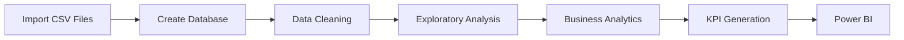

# 💻 SQL Analysis Documentation

## Brazilian E-Commerce Business Intelligence Project

> Comprehensive documentation of the SQL analyses powering the Business Intelligence solution.

---

# 📖 Table of Contents

- Introduction
- SQL Workflow
- SQL Design Philosophy
- Database Preparation
- Module 01 – Database Setup
- Module 02 – Order Analysis
- Module 03 – Customer Behavior Analysis
- Module 04 – Revenue Analysis
- Module 05 – Customer Lifetime Value
- Module 06 – Product & Seller Analysis
- Module 07 – Product Category Analysis
- Module 08 – Time Series Analysis
- Module 09 – RFM Analysis
- Module 10 – Cohort Analysis
- Module 11 – Pareto Analysis
- Module 12 – Delivery Analysis
- SQL Skills Demonstrated
- Conclusion

---

# 📌 Introduction

SQL forms the analytical foundation of this Business Intelligence project.

Every KPI, dashboard, and business insight presented in Power BI originates from structured SQL analysis performed on the Brazilian E-Commerce (Olist) dataset.

Rather than writing isolated queries, the project follows a modular analytical framework where each SQL script focuses on a specific business domain.

This approach offers several advantages:

- Improved readability
- Easier maintenance
- Reusable analytical components
- Clear separation of business problems
- Simplified debugging
- Better scalability

Collectively, the twelve SQL modules transform normalized transactional data into executive-ready business intelligence.

---

# 🏗 SQL Workflow

The SQL workflow follows a structured analytical pipeline.

Each SQL module builds upon previous analyses while remaining independently executable.

---

# 🎯 SQL Design Philosophy

The analytical framework was designed using several guiding principles.

## 1. Modularity

Each business problem is solved in a separate SQL script.

Instead of creating one extremely large SQL file, the project separates analyses into logical modules.

Advantages include:

- Easier debugging
- Better documentation
- Improved maintainability
- Simpler Git version control

---

## 2. Readability

Queries prioritize clarity over unnecessary optimization.

Techniques used include:

- Common Table Expressions (CTEs)
- Meaningful aliases
- Consistent formatting
- Logical ordering
- Clear comments

---

## 3. Reusability

Many intermediate calculations are created using reusable CTEs.

Examples include:

- Customer revenue
- Monthly revenue
- Seller revenue
- Cohort calculations
- RFM scores

This minimizes duplicated SQL code.

---

## 4. Business Orientation

Every SQL query answers a real business question.

Instead of writing queries simply to demonstrate syntax, each module was designed around business requirements commonly encountered by Business Intelligence teams.

---

# 🗄 Module 01 — Database Setup

📄 **File:** `01_database_setup.sql`

---

## Business Objective

Prepare the analytical environment by creating the database, importing all datasets, and validating relationships.

Reliable analytics begin with reliable data.

Before any reporting can occur, the database must accurately represent the transactional structure of the business.

---

## SQL Tasks

This module performs:

- Database creation
- Table creation
- CSV import
- Initial validation
- Relationship verification

---

## SQL Concepts Demonstrated

- CREATE DATABASE
- CREATE TABLE
- LOAD DATA
- Data validation
- Relational modeling

---

## Business Questions Addressed

- Has the data been imported successfully?
- Are all required tables available?
- Are relationships preserved?
- Is the environment ready for analysis?

---

## Business Value

Establishes a reliable analytical foundation that supports all downstream SQL analyses.

---

# 📦 Module 02 — Order Analysis

📄 **File:** `02_order_analysis.sql`

---

## Business Objective

Orders represent the core transactional activity of the marketplace.

This module evaluates order volume, fulfillment performance, and operational efficiency.

Understanding order trends enables executives to monitor company performance while identifying fulfillment issues.

---

## Analytical Process

The analysis measures:

- Total orders
- Delivered orders
- Cancelled orders
- Order status distribution
- Delivery duration
- On-time delivery performance

These metrics establish a baseline for evaluating operational health.

---

## SQL Techniques Used

- Aggregate Functions
- GROUP BY
- CASE Statements
- Multi-table Joins
- Date Functions

---

## Business Questions Addressed

- How many orders were completed?
- What percentage of orders were cancelled?
- How long does delivery take?
- Is fulfillment improving?

---

## Key Deliverables

✔ Order KPIs

✔ Fulfillment Metrics

✔ Delivery Performance

✔ Operational Dashboard Inputs

---

## Business Impact

Order analysis provides executives with visibility into the efficiency of the order fulfillment process.

Monitoring these metrics enables organizations to identify operational bottlenecks before they negatively affect customer satisfaction.

---

# 👥 Module 03 — Customer Behavior Analysis

📄 **File:** `03_customer_behavior_analysis.sql`

---

## Business Objective

Customer behavior directly influences long-term profitability.

This module analyzes purchasing patterns to better understand customer engagement.

Rather than measuring total customers alone, the analysis evaluates how customers interact with the marketplace over time.

---

## Analytical Process

The module calculates:

- Purchase frequency
- Orders per customer
- Repeat purchasing
- Customer ranking
- Revenue contribution

---

## SQL Techniques Used

- COUNT(DISTINCT)
- GROUP BY
- Aggregate Functions
- Ranking
- Customer-level aggregation

---

## Business Questions Addressed

- Which customers purchase most frequently?
- How concentrated is customer activity?
- What percentage of customers return?
- How active are repeat customers?

---

## Key Deliverables

✔ Customer KPIs

✔ Repeat Purchase Metrics

✔ Purchase Frequency

✔ Customer Ranking

---

## Business Impact

Customer behavior analysis helps organizations improve retention strategies, customer engagement, and long-term revenue generation.

---

# 💰 Module 04 — Revenue Analysis

📄 **File:** `04_revenue_analysis.sql`

---

## Business Objective

Revenue is one of the most critical indicators of business success.

This module transforms transactional data into financial KPIs capable of supporting executive reporting.

Revenue is analyzed across multiple dimensions including time, orders, and purchasing behavior.

---

## Analytical Process

The module calculates:

- Total Revenue
- Monthly Revenue
- Average Order Value
- Revenue Growth
- Revenue Trends

Historical revenue patterns are evaluated to identify seasonality and long-term growth.

---

## SQL Techniques Used

- SUM()
- AVG()
- Window Functions
- Monthly Aggregation
- Date Functions

---

## Business Questions Addressed

- Is revenue increasing?
- Which months perform best?
- Are sales seasonal?
- How much does each order contribute?

---

## Key Deliverables

✔ Revenue KPIs

✔ Monthly Sales Trends

✔ Average Order Value

✔ Revenue Dashboard Inputs

---

## Business Impact

Revenue analytics provides executives with continuous visibility into financial performance, enabling informed strategic planning and forecasting.

---

---

# 💎 Module 05 — Customer Lifetime Value (CLV)

📄 **File:** `05_customer_lifetime_value.sql`

---

## Business Objective

Customer acquisition is only the beginning of a successful e-commerce business.

Long-term profitability depends on retaining customers and maximizing the total value they generate throughout their relationship with the company.

This module calculates **Customer Lifetime Value (CLV)** by combining purchasing frequency, total revenue, and average order value to estimate each customer's long-term contribution.

Unlike simple revenue rankings, CLV focuses on customer profitability over time rather than isolated transactions.

---

## Analytical Process

The analysis begins by aggregating customer-level purchasing activity before calculating:

- Total Revenue per Customer
- Number of Orders
- Average Order Value
- Purchase Frequency
- Estimated Customer Lifetime Value

The resulting metrics provide a foundation for customer segmentation and long-term marketing strategy.

---

## SQL Techniques Used

- Common Table Expressions (CTEs)
- Aggregate Functions
- GROUP BY
- SUM()
- AVG()
- COUNT(DISTINCT)
- Derived Metrics

---

## Business Questions Addressed

- Which customers generate the greatest long-term value?
- How valuable is each customer beyond a single purchase?
- Which customers should receive premium retention efforts?
- How should marketing investment be prioritized?

---

## Key Deliverables

✔ Customer Lifetime Value

✔ Customer Revenue Ranking

✔ Purchase Frequency

✔ Average Order Value

✔ Customer Profitability Metrics

---

## Business Impact

Customer Lifetime Value enables organizations to shift from transaction-focused decision-making toward long-term customer relationship management.

Instead of measuring success solely through sales volume, executives can prioritize sustainable profitability by investing in customers who create the greatest long-term value.

---

# 🏪 Module 06 — Product & Seller Analysis

📄 **File:** `06_product_and_seller_analysis.sql`

---

## Business Objective

Marketplace success depends on both product demand and seller performance.

This module evaluates how individual sellers contribute to overall marketplace success while simultaneously measuring product sales performance.

The analysis identifies top-performing sellers, compares revenue generation, and highlights operational differences across the marketplace.

---

## Analytical Process

Seller performance is evaluated using:

- Total Revenue
- Orders Fulfilled
- Items Sold
- Average Order Value
- Revenue Ranking

Product-level metrics are analyzed alongside seller performance to provide a complete marketplace perspective.

---

## SQL Techniques Used

- Window Functions
- RANK()
- Aggregate Functions
- GROUP BY
- Multi-table Joins

---

## Business Questions Addressed

- Which sellers generate the highest revenue?
- Which sellers fulfill the most orders?
- Are revenue leaders also operational leaders?
- Which sellers require performance improvement?

---

## Key Deliverables

✔ Seller Rankings

✔ Revenue by Seller

✔ Orders per Seller

✔ Product Performance Metrics

✔ Marketplace Performance Indicators

---

## Business Impact

Seller performance analysis enables marketplace managers to identify operational best practices, reward high-performing sellers, and improve overall marketplace quality.

It also provides valuable insight into vendor management and operational optimization.

---

# 🛍 Module 07 — Product Category Analysis

📄 **File:** `07_product_category_analysis.sql`

---

## Business Objective

Product categories contribute differently to marketplace performance.

Understanding these differences allows organizations to optimize merchandising strategies, inventory planning, and promotional investments.

This module evaluates category-level performance across multiple financial and operational dimensions.

---

## Analytical Process

The analysis measures:

- Revenue by Category
- Items Sold
- Orders by Category
- Average Selling Price
- Category Rankings
- Revenue Contribution

Category performance is compared to determine which product groups drive marketplace growth.

---

## SQL Techniques Used

- Aggregate Functions
- GROUP BY
- Revenue Distribution
- Ranking
- Multi-table Joins

---

## Business Questions Addressed

- Which categories generate the highest revenue?
- Which categories sell the most products?
- Which categories command the highest prices?
- How concentrated is category revenue?

---

## Key Deliverables

✔ Category Rankings

✔ Revenue by Category

✔ Items Sold

✔ Average Selling Price

✔ Revenue Contribution Analysis

---

## Business Impact

Category-level insights support inventory optimization, promotional planning, pricing decisions, and long-term merchandising strategy.

High-performing categories can receive additional investment while low-performing categories can be evaluated for improvement.

---

# 📈 Module 08 — Time Series Analysis

📄 **File:** `08_time_series_analysis.sql`

---

## Business Objective

Business performance changes over time.

This module evaluates revenue, order volume, and purchasing behavior across monthly periods to identify long-term trends, seasonality, and growth patterns.

Rather than relying on static performance snapshots, time-series analysis provides a dynamic view of business performance.

---

## Analytical Process

Monthly metrics are calculated including:

- Revenue
- Orders
- Average Order Value
- Revenue Growth
- Month-over-Month Change
- Sales Trends

Historical performance is evaluated to identify recurring seasonal patterns and significant business changes.

---

## SQL Techniques Used

- Window Functions
- LAG()
- Running Totals
- Date Functions
- Aggregate Functions
- Monthly Grouping

---

## Business Questions Addressed

- Is revenue growing consistently?
- Which months perform best?
- Are purchasing patterns seasonal?
- How does Average Order Value change over time?
- Which months require greater operational preparation?

---

## Key Deliverables

✔ Monthly Revenue

✔ Revenue Trend Analysis

✔ Month-over-Month Growth

✔ Seasonal Analysis

✔ Executive Trend Reporting

---

## Business Impact

Time-series analysis enables organizations to forecast future demand, prepare inventory, optimize staffing levels, and schedule marketing campaigns based on historical performance rather than assumptions.

The insights generated through this module also provide the analytical foundation for executive trend reporting within the Power BI dashboards.

---

---

# 🏆 Module 09 — RFM Customer Segmentation

📄 **File:** `09_RFM_analysis.sql`

---

## Business Objective

Not every customer contributes equally to business success.

This module applies the **RFM (Recency, Frequency, Monetary)** framework to classify customers according to purchasing behavior and long-term business value.

Rather than treating every customer identically, RFM analysis identifies meaningful customer segments that support personalized marketing, customer retention, and revenue optimization.

The resulting segmentation allows the business to focus resources where they generate the highest return.

---

## Analytical Process

The analysis follows three sequential steps.

### Step 1 — Calculate Customer Metrics

Each customer is evaluated using three behavioral dimensions:

- **Recency** – Number of days since the customer's most recent purchase
- **Frequency** – Total number of completed orders
- **Monetary Value** – Total revenue generated by the customer

---

### Step 2 — Score Each Metric

Customers are assigned scores using SQL window functions.

Each metric is divided into five equal groups using **NTILE(5)**.

Higher scores indicate stronger customer performance.

---

### Step 3 — Create Customer Segments

Individual RFM scores are combined into business-friendly customer segments.

Examples include:

- Champions
- Loyal Customers
- Potential Loyalists
- New Customers
- Promising
- Need Attention
- About to Sleep
- At Risk
- Lost Customers

---

## SQL Techniques Used

- Common Table Expressions (CTEs)
- Window Functions
- NTILE()
- CASE Statements
- Aggregate Functions
- Customer-Level Aggregations

---

## Business Questions Addressed

- Who are the most valuable customers?
- Which customers generate the greatest revenue?
- Which customers are likely to churn?
- Which customers should receive retention campaigns?
- Which customers deserve premium loyalty rewards?

---

## Key Deliverables

✔ Customer RFM Scores

✔ Customer Segments

✔ Revenue by Segment

✔ Customer Rankings

✔ Marketing Target Lists

---

## Business Impact

RFM analysis enables highly targeted customer engagement.

Instead of sending identical promotions to every customer, organizations can personalize campaigns according to customer value and purchasing behavior.

This improves marketing efficiency while increasing customer retention and long-term profitability.

---

# 👥 Module 10 — Cohort Analysis

📄 **File:** `10_cohort_analysis.sql`

---

## Business Objective

Acquiring customers is important.

Keeping them is even more important.

This module evaluates customer retention by grouping customers according to the month of their first purchase and measuring how purchasing behavior changes over time.

Unlike traditional repeat-purchase metrics, Cohort Analysis reveals long-term customer engagement patterns.

---

## Analytical Process

The analysis proceeds through four stages.

### Step 1

Determine each customer's first purchase month.

---

### Step 2

Assign customers to a monthly acquisition cohort.

---

### Step 3

Calculate the number of months since acquisition.

---

### Step 4

Measure how many customers continue purchasing over time.

The final output forms a retention matrix suitable for visualization within Power BI.

---

## SQL Techniques Used

- Common Table Expressions
- TIMESTAMPDIFF()
- MIN()
- GROUP BY
- Date Functions

---

## Business Questions Addressed

- How well does the business retain customers?
- Which acquisition months produced the strongest retention?
- How quickly does customer engagement decline?
- Are retention initiatives improving?

---

## Key Deliverables

✔ Cohort Matrix

✔ Monthly Retention

✔ Repeat Purchase Trends

✔ Customer Retention Metrics

---

## Business Impact

Retention is one of the most important drivers of long-term profitability.

Cohort Analysis provides executives with a clear understanding of customer engagement over time while supporting improvements to customer experience and marketing strategy.

---

# 📊 Module 11 — Pareto Analysis

📄 **File:** `11_pareto_analysis.sql`

---

## Business Objective

Many businesses observe that a relatively small proportion of customers generates a large proportion of total revenue.

This module evaluates that relationship using the Pareto Principle.

Rather than assuming revenue is evenly distributed, the analysis measures cumulative customer contribution and revenue concentration.

---

## Analytical Process

The workflow includes:

- Customer Revenue Calculation
- Revenue Ranking
- Running Revenue Total
- Cumulative Revenue Percentage
- Customer Contribution Percentage

These metrics determine how revenue accumulates across the customer base.

---

## SQL Techniques Used

- SUM() OVER()
- Window Functions
- Running Totals
- Cumulative Percentage
- Ranking Functions

---

## Business Questions Addressed

- How concentrated is company revenue?
- What percentage of customers generates most revenue?
- Does the business depend heavily on high-value customers?
- Which customers deserve retention priority?

---

## Key Deliverables

✔ Customer Revenue Ranking

✔ Revenue Concentration

✔ Pareto Curve Data

✔ Executive KPI

---

## Business Impact

Understanding revenue concentration enables better strategic planning.

Organizations can reduce revenue risk by protecting relationships with high-value customers while simultaneously expanding their broader customer base.

---

# 🚚 Module 12 — Delivery Performance Analysis

📄 **File:** `12_delivery_analysis.sql`

---

## Business Objective

Customer experience depends heavily on reliable delivery.

This module evaluates logistics performance across sellers, orders, and geographic regions.

The analysis identifies operational bottlenecks that influence customer satisfaction and business efficiency.

---

## Analytical Process

Delivery performance is evaluated using:

- Delivery Duration
- Estimated Delivery Date
- Actual Delivery Date
- Late Deliveries
- On-Time Deliveries
- State-Level Delivery Metrics

The analysis compares logistics performance across sellers and regions.

---

## SQL Techniques Used

- DATEDIFF()
- CASE Statements
- Aggregate Functions
- GROUP BY
- Ranking

---

## Business Questions Addressed

- Which regions experience delivery delays?
- Which sellers consistently deliver on time?
- How efficient is the logistics network?
- Where should operational improvements be prioritized?

---

## Key Deliverables

✔ Delivery KPIs

✔ Average Delivery Time

✔ On-Time Delivery Rate

✔ State Rankings

✔ Seller Performance

---

## Business Impact

Delivery performance directly influences customer satisfaction, repeat purchasing behavior, and brand perception.

Monitoring these metrics enables organizations to improve operational efficiency while strengthening customer trust.

---

# 🧠 SQL Best Practices Applied

Throughout the project, several SQL development best practices were consistently followed.

## Modular Query Design

Each analytical problem was solved in an independent SQL module, improving readability and maintainability.

---

## Common Table Expressions (CTEs)

CTEs were used extensively to simplify complex analytical workflows while avoiding deeply nested subqueries.

---

## Meaningful Aliases

Tables, columns, and calculated fields were assigned descriptive aliases to improve readability and maintainability.

---

## Defensive Query Design

Queries were written to handle edge cases wherever appropriate, ensuring that analyses remain reliable even if the underlying dataset changes.

---

## Consistent Formatting

A standardized SQL formatting style was maintained across all scripts, making the code easier to review, debug, and extend.

---

# 🚀 SQL Skills Demonstrated

This project demonstrates practical application of SQL across multiple analytical domains.

### Core SQL

- SELECT
- WHERE
- ORDER BY
- GROUP BY
- HAVING
- DISTINCT

---

### Advanced SQL

- Common Table Expressions (CTEs)
- Window Functions
- Ranking Functions
- Running Totals
- Conditional Logic
- Date Functions
- Customer Segmentation
- Cohort Analysis
- Pareto Analysis

---

### Business Intelligence

- KPI Development
- Revenue Analytics
- Customer Analytics
- Operational Analytics
- Time Series Analysis
- Executive Reporting
- Data Storytelling

---

# 🏁 Technical Conclusion

The SQL implementation within this project extends well beyond basic querying.

Each module was designed to answer a specific business question while following principles of modularity, readability, and maintainability.

The analyses collectively demonstrate how SQL can be used not only for data retrieval but also for solving real-world business problems through customer segmentation, revenue analysis, operational monitoring, and executive reporting.

The outputs generated by these SQL scripts form the analytical foundation of the Power BI dashboards and business recommendations presented throughout this repository.

Rather than showcasing SQL syntax in isolation, this project demonstrates how SQL functions as a critical component of an end-to-end Business Intelligence workflow.

---
